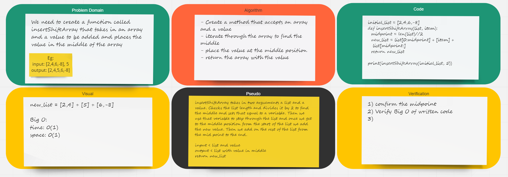

# Challenge Summary

## Challenge Description
Write a function called insertShiftArray which takes in an array and a value to be added. Without utilizing any of the built-in methods available to your language, return an array with the new value added at the middle index.

## Approach & Efficiency
For this problem, I decided to divide my input list by 2 using the floor division operator.  I made a new list and added manually the desired value between the first half and the second half.

## Solution:

