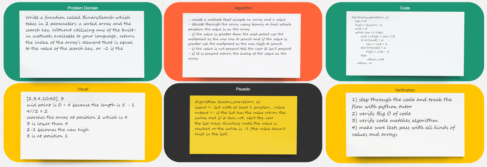

# Challenge Summary

## Challenge Description
Write a function called BinarySearch which takes in 2 parameters: a sorted array and the search key. Without utilizing any of the built-in methods available to your language, return the index of the array’s element that is equal to the value of the search key, or -1 if the element is not in the array.

## Approach & Efficiency
For this problem, I decided to create an iterative binary search function.  It returns the index of x in the given array if arr is present.  Else, it returns -1

## Solution:

