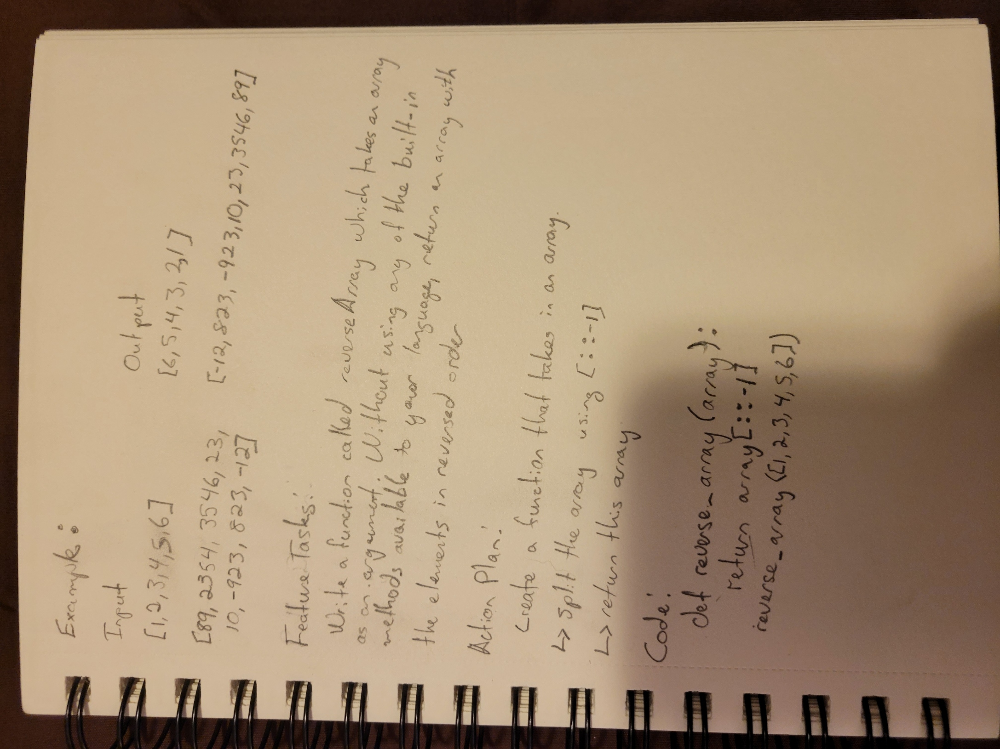

# Challenge Summary

## Challenge Description
Write a function called reverseArray which takes an array as an argument. Without utilizing any of the built-in methods available to your language, return an array with elements in reversed order.

## Approach & Efficiency
Since we were not supposed to use any methods for this function, I used the splice method.

## Solution:

